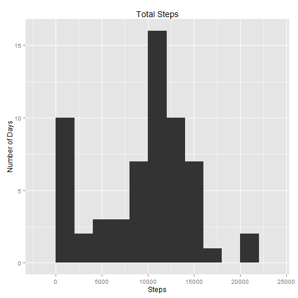
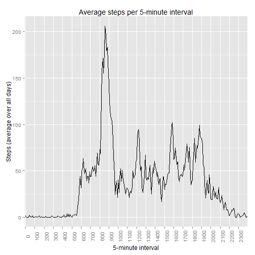
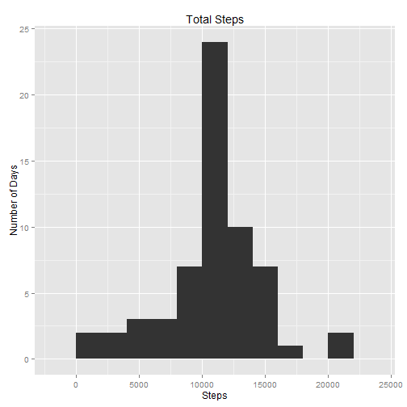
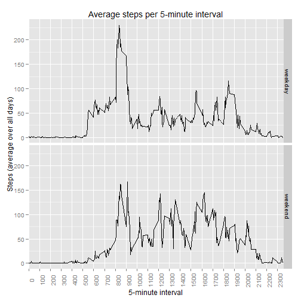

## Loading and preprocessing the data


```r
# Load ggplot2 library since we will use it for plots
library(ggplot2)

# Read in the data file
mydata <- read.csv("activity.csv")

# Transform date strings into Date objects
mydata$date <- as.Date(mydata$date)
```
<br>
---
---

## What is mean total number of steps taken per day?

#### 1. Make a histogram of the total number of steps taken each day

```r
# Sum steps by date
steps_by_date <- aggregate(mydata$steps,
                           by=list(date=mydata$date),
                           sum,
                           na.rm=TRUE)

# Make the "steps per day" column more readable
names(steps_by_date)[names(steps_by_date)=="x"] <- "steps"

# Plot a histogram of steps per day
qplot(steps,
      data=steps_by_date,
      geom="histogram",
      ylab="Number of Days",
      xlab="Steps",
      main="Total Steps",
      binwidth=2000
     )
```

 
<br>

#### 2. Calculate and report the *mean* and *median* total number of steps taken per day

```r
# mean steps per date
(steps_mean <- mean(steps_by_date$steps, na.rm=TRUE))
```

```
## [1] 9354
```

```r
# median steps per date
(steps_median <- median(steps_by_date$steps, na.rm=TRUE))
```

```
## [1] 10395
```

**The mean total number of steps taken per day = steps_mean = <font color="blue">9354.2295</font>.**  
**The median total number of steps taken per day = steps_median = <font color="blue">10395</font>.**
<br>
---
---

## What is the average daily activity pattern?

#### 1. Make a time series plot (i.e. type = "l") of the 5-minute interval (x-axis) and the average number of steps taken, averaged across all days (y-axis)

```r
# Average steps by interval
steps_by_interval <- aggregate(mydata$steps,
                               by=list(interval=mydata$interval),
                               mean,
                               na.rm=TRUE)

# Make the "steps" column more readable
names(steps_by_interval)[names(steps_by_interval)=="x"] <- "steps"

# Generate x-axis ticks
max_interval <- max(steps_by_interval$interval)
x_incr <- 100
x_axis_ticks <- seq(
  from=0, 
  to=max_interval + 2*x_incr,
  by=x_incr
  )

# Plot the line graph
g <- ggplot(steps_by_interval, aes(interval, steps)) +
    geom_line() +
    xlab("5-minute interval") +
    ylab("Steps (average over all days)") +
    labs(title="Average steps per 5-minute interval") +
    scale_x_discrete(labels=as.character(x_axis_ticks),
                     breaks=x_axis_ticks) +
    theme(axis.text.x=element_text(angle=90))
print(g)
```

 

#### 2. Which 5-minute interval, on average across all the days in the dataset, contains the maximum number of steps?

```r
# Get the maximum of the average number of steps over all intervals
max_steps <- max(steps_by_interval$steps, na.rm=TRUE)
max_steps_df <- subset(steps_by_interval, steps==max_steps)
(max_steps_interval <- max_steps_df[1,"interval"])
```

```
## [1] 835
```

**The 5-minute interval, on average across all the days in the dataset, containing the maximum number of steps = max_steps_interval = <font color="blue">835</font>.**
<br>
---
---

## Imputing missing values

#### 1. Calculate and report the total number of missing values in the dataset (i.e. the total number of rows with NAs)

```r
# Get the complete cases
complete_cases <- complete.cases(mydata)

# Get the number of complete cases
num_complete_cases <- sum(complete_cases)

# num_cases
num_cases_total <- nrow(mydata)

# Number of rows with NAs
(num_incomplete_cases <- num_cases_total - num_complete_cases)
```

```
## [1] 2304
```

**The total number of missing values in the dataset (i.e. the total number of rows with NAs) = num_incomplete_cases = <font color="blue">2304</font>.**  
<br>

#### 2. Devise a strategy for filling in all of the missing values in the dataset. The strategy does not need to be sophisticated. For example, you could use the mean/median for that day, or the mean for that 5-minute interval, etc.


**Description of my strategy for imputing missing data:**

My strategy for imputing the data will be to replace any rows in the data set where steps==NA with a new row. The new row's 'steps' field will be the average value of steps during the same time interval, averaged across all days.

I carefully verified that no 'date' values were missing, nor were any 'interval' values missing. So there is no need to impute missing values for either 'date' or 'interval' and hence I will not write code to do so.
The following code (and its output) justifies this decision:
<br><br>


```r
# 'steps' column _does_ have missing values, so will impute
sum(is.na(mydata$steps))
```

```
## [1] 2304
```

```r
# 'date' column has no missing values; no need to impute
sum(is.na(mydata$date))
```

```
## [1] 0
```

```r
# 'interval' column has no missing values; no need to impute
sum(is.na(mydata$interval))
```

```
## [1] 0
```

#### 3. Create a new dataset that is equal to the original dataset but with the missing data filled in.

```r
# Use average steps by interval because (1) it is already available/
# computed (steps_by_interval), and (2) some days have NA's for all
# intervals, so a mean for the day would be Nan and median would be NA.
# In other words, neither mean nor median per day will be useful methods
# for imputing missing 'steps' values.

# New data frame for imputed data. Start by copying the original data
# set, mydata.
mydata.imputed <- mydata

# Replace steps with the interval average in any row where steps==NA
for (i in 1:num_cases_total) {
    if (is.na(mydata$steps[i])) { # steps==NA?
        # Interval for row i
        thisInterval <- mydata$interval[i]
        
        # The row in steps_by_interval corresponding to this interval.
        # This corresponds to the average 'steps' value across all days
        # for the same time interval.
        selectedRow <- thisInterval == steps_by_interval$interval
        
        # Pull the selected row out of the steps_by_interval data frame
        averageSteps.df <- steps_by_interval[selectedRow,]
        
        # Substitute the (average) steps value for the missing value
        mydata.imputed$steps[i] <- averageSteps.df[1, c("steps")]
    }
}
```

#### 4. Make a histogram of the total number of steps taken each day and Calculate and report the mean and median total number of steps taken per day. Do these values differ from the estimates from the first part of the assignment? What is the impact of imputing missing data on the estimates of the total daily number of steps?

```r
# Sum steps by date
steps_by_date <- aggregate(mydata.imputed$steps,
                           by=list(date=mydata.imputed$date),
                           sum)

# Make the "steps per day" column more readable
names(steps_by_date)[names(steps_by_date)=="x"] <- "steps"

# Plot a histogram of steps per day
qplot(steps,
      data=steps_by_date,
      geom="histogram",
      ylab="Number of Days",
      xlab="Steps",
      main="Total Steps",
      binwidth=2000
     )
```

 
<br>

#### Calculate and report the *mean* and *median* total number of steps taken per day

```r
# mean steps per date
(steps_mean.imputed <- mean(steps_by_date$steps))
```

```
## [1] 10766
```

```r
# median steps per date
(steps_median.imputed <- median(steps_by_date$steps))
```

```
## [1] 10766
```

**The mean total number of steps taken per day = steps_mean.imputed = <font color="blue">1.0766 &times; 10<sup>4</sup></font>.**  
**The median total number of steps taken per day = steps_median.imputed = <font color="blue">1.0766 &times; 10<sup>4</sup></font>.**

#### Do these values differ from the estimates from the first part of the assignment?

Yes. In the estimates from the first part of the assignment, the mean and median were both smaller than the new estimates after imputing missing data. Also the original mean and median were not nearly as close together as the new mean and median are. Actually, the new mean and median seem to be nearly identical.
The differences between original mean and median, and the mean and median after imputing missing values, is shown as following:
<br><br>


```r
# Difference between original mean and mean after imputing missing values
steps_mean.imputed - steps_mean
```

```
## [1] 1412
```

```r
# Difference between original median and the median after imputing missing values
steps_median.imputed - steps_median
```

```
## [1] 371.2
```

#### What is the impact of imputing missing data on the estimates of the total daily number of steps?

**Central Tendency Statistics (mean and median):**  
The mean and median both became larger, and they became closer to each other. Actually, they seem to be nearly identical.
<br><br>
**Distribution:**  
The original distribution had a relatively large number of days that had a small number of total steps, which is seen in the "peak" between 0-2000 steps. The original distribution also had a "peak" between 10,000 and 12,000 steps. The new distribution only has a single "peak" - also between 10,000 and 12,000 steps - and is relatively symmetric around the mean. The mean being very close to the median is a reflection of the relative symmetry in the new distribution.
<br>
---
---

## Are there differences in activity patterns between weekdays and weekends?

#### 1. Create a new factor variable in the dataset with two levels - "weekday" and "weekend" indicating whether a given date is a weekday or weekend day.

```r
# Character vector of weekday name in string form
all_days <- weekdays(mydata$date)

# Logical vector for weekend days
weekends.logi <- grepl("^(Saturday|Sunday)$", all_days)

# Create a factor variable with two levels - "weekday" and "weekend"
mydata.imputed$weekdays.f <- factor(weekends.logi, labels = c("weekday", "weekend"))

# Some basic information about the new factor variable
str(mydata.imputed$weekdays.f)
```

```
##  Factor w/ 2 levels "weekday","weekend": 1 1 1 1 1 1 1 1 1 1 ...
```

#### 2. Make a panel plot containing a time series plot (i.e. type = "l") of the 5-minute interval (x-axis) and the average number of steps taken, averaged across all weekday days or weekend days (y-axis).

```r
# Average steps by interval
steps_by_interval <- aggregate(mydata.imputed$steps,
                               by=list(interval=mydata.imputed$interval,
                                       DayType=mydata.imputed$weekdays.f),
                               mean,
                               na.rm=TRUE)

# Make the "steps" column more readable
names(steps_by_interval)[names(steps_by_interval)=="x"] <- "steps"

# Generate x-axis ticks
max_interval <- max(steps_by_interval$interval)
x_incr <- 100
x_axis_ticks <- seq(
  from=0, 
  to=max_interval + 2*x_incr,
  by=x_incr
  )

# Plot the line graph
g <- ggplot(steps_by_interval, aes(interval, steps)) +
    geom_line(aes(color=DayType)) +
    facet_grid(DayType ~ .) +
    theme(legend.position="none") +
    xlab("5-minute interval") +
    ylab("Steps (average over all days)") +
    labs(title="Average steps per 5-minute interval") +
    scale_x_discrete(labels=as.character(x_axis_ticks),
                     breaks=x_axis_ticks) +
    theme(axis.text.x=element_text(angle=90))
print(g)
```

 

---
